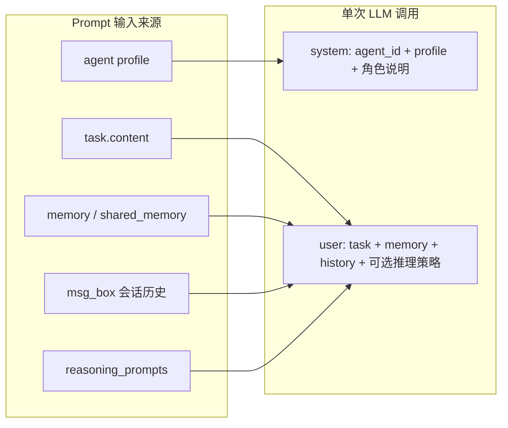
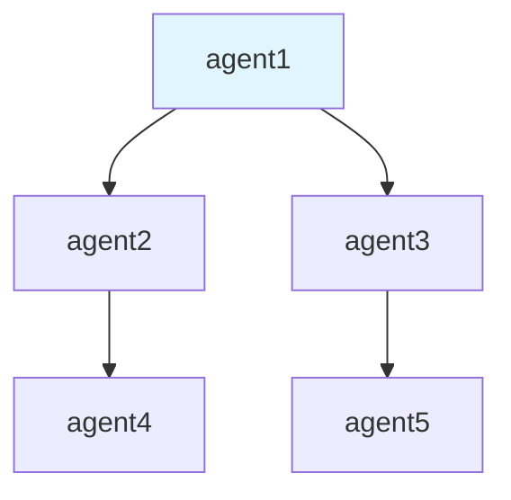
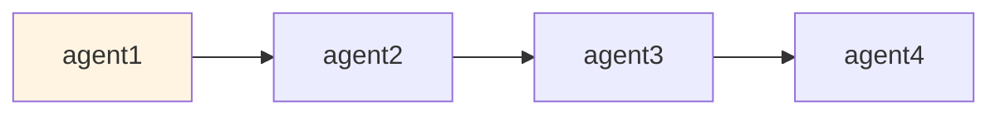
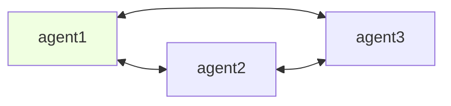

# MARBLE 数据集：Prompt 结构与 Agent 交互关系

本页仅介绍 `benchmark/multi_agent/MARBLE` 中数据集的 **Prompt 结构** 与 **Agent 之间的交互关系**。MARBLE（Multi-Agent Coordination Backbone with LLM Engine）使用 YAML 配置描述任务、Agent 与图结构，通过 Engine 按不同协调模式调度多 Agent。

---

## 一、Prompt 结构

MARBLE 的「数据集」体现为配置目录下的 YAML 文件（如 `marble/configs/`、`marble/configs/coding_config/`、`marble/configs/test_config_*.yaml`）。单条样本对应一个配置文件，其中定义了任务、Agent 列表、关系与协调模式，进而决定发给 LLM 的 prompt 内容。

### 1.1 配置层级与对应 Prompt 来源

| 配置块 | 含义 | 在 Prompt 中的体现 |
|--------|------|--------------------|
| `task.content` | 任务描述（如软件开发需求、讨论主题） | 作为 user 消息中的「任务」正文 |
| `task.output_format` | 期望输出格式说明 | 约束最终交付形式 |
| `agents[].agent_id` | Agent 标识 | 出现在 system_message 与对话中的称呼 |
| `agents[].profile` | Agent 角色/专长描述 | 拼进 system_message：`You are "{agent_id}": "{profile}"` |
| `engine_planner.initial_progress` | 引擎初始进度描述 | 规划/进度类 prompt 的上下文 |

### 1.2 单次 LLM 调用的 Prompt 组成

每次调用 LLM 时，消息结构为：

- **System**：`You are "{agent_id}": "{profile}"` + 固定角色扮演说明（与其它 agent 协作/竞争、保持人设等）。
- **User**：由当前任务、记忆、会话历史等拼接而成；具体内容依赖环境与动作类型（见下）。



### 1.3 推理策略（Reasoning Prompts）

Agent 可配置 `strategy`，对应不同的推理提示（在 `base_agent.reasoning_prompts` 或 `prompt_config.yaml` 中）：

- **default**：无额外推理指引。
- **cot**：链式思考（步骤目标、资源、方法、行动）。
- **reflexion**：先想法 → 分析选项 → 挑战与方案 → 决策。
- **react**：Observation → Thought → Action → Result。

这些内容会进入 user 侧 prompt，引导模型按相应方式推理。

### 1.4 通信场景下的 Prompt（communicate_to）

当 Agent 通过 `communicate_to` 与另一 Agent 对话时，user 侧会包含：

- 当前记忆、任务、对方 profile；
- 本 session 的聊天历史（由 `msg_box` 序列化）；
- 上一条对方消息；
- 约束（如「仅与当前对话对象交流」「无法回答时返回 \<end-of-session\>」）。

同时会注入 `communicate_to` 的 function/tool 描述，供模型选择是否发消息及内容。

---

## 二、Agent 之间的交互关系

交互关系由配置中的 **`coordinate_mode`** 与 **`relationships`** 决定，由 `AgentGraph` 与 `Engine` 执行。

### 2.1 协调模式（coordinate_mode）

| 模式 | 含义 | 执行特点 |
|------|------|----------|
| **chain** | 链式 | 从初始 agent 开始，每步当前 agent 执行后选择「下一个 agent」与传递的 task，顺序执行。 |
| **tree** | 树形 | 存在唯一 root；关系为 `parent`；parent 可向 children 下发任务，按树遍历。 |
| **graph** | 图/协作 | 任意二元关系（如 `collaborates with`）；可并行分配任务或按轮次执行，agent 间通过 `communicate_to` 对话。 |
| **star** | 星形/中心化 | 以某中心节点调度其它 agent（集中式编排）。 |

### 2.2 关系定义（relationships）

在 YAML 中以三元组列表给出：

```yaml
relationships:
  - [source_agent_id, target_agent_id, "relationship_type"]
```

例如：

- Tree：`[agent1, agent2, "parent"]` 表示 agent1 是 agent2 的父节点。
- Graph/Chain：`[agent1, agent2, "reports_to"]`、`[agent1, agent3, "collaborates with"]` 等表示汇报、协作等关系。

只有存在关系的 agent 对之间才允许 `communicate_to` 发送消息。

### 2.3 交互结构 Mermaid 图

**Tree 模式示例**（parent 关系，一层层下发）：



**Chain 模式示例**（顺序传递，当前 agent 选下一个）：



**Graph 模式示例**（多对多协作，可互相 communicate_to）：



### 2.4 消息传递与共享状态

- **msg_box**：每个 agent 维护 `msg_box[session_id][other_agent_id]`，列表元素为 `(direction, content)`，其中 `FORWARD_TO` 表示发出，`RECV_FROM` 表示收到。序列化后放入通信相关 prompt。
- **communicate_to**：发送方调用 `send_message(session_id, target_agent, message)`，接收方对应队列追加一条 `(RECV_FROM, message)`；会话内多轮对话直至某一方返回 `<end-of-session>` 或达到轮数上限。
- **SharedMemory**：多 agent 共享的键值存储（如 `storage[key]`），用于共享任务结果或中间信息，在 prompt 中通过「记忆」或上下文形式提供给 LLM。

```mermaid
sequenceDiagram
    participant A as Agent A
    participant Box as msg_box
    participant B as Agent B
    A->>Box: send_message(session_id, B, msg)
    Note over Box: A->B: (FORWARD_TO, msg)
    B->>B: receive: (RECV_FROM, msg) 写入 msg_box
    B->>Box: send_message(session_id, A, reply)
    Note over Box: B->A: (FORWARD_TO, reply)
    A->>A: receive: (RECV_FROM, reply) 写入 msg_box
```

---

## 三、小结

- **Prompt 结构**：由 YAML 中的 `task`、`agents[].profile`、`engine_planner` 等驱动；单次调用 = system（agent_id + profile + 角色说明）+ user（任务 + 记忆 + 会话历史 + 可选推理策略）；通信时还会加入 `msg_box` 与 `communicate_to` 的 tool 描述。
- **Agent 交互**：由 `coordinate_mode`（chain / tree / graph / star）和 `relationships` 定义图结构；通过 `msg_box` 做定向会话、通过 `communicate_to` 发起对话、通过 `SharedMemory` 共享状态；Engine 按所选模式调度执行与任务传递。

上述配置与逻辑均来自 `benchmark/multi_agent/MARBLE` 代码与 YAML，可直接对应到 `marble/configs/`、`marble/agent/base_agent.py`、`marble/graph/agent_graph.py`、`marble/engine/engine.py` 等实现。
